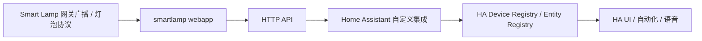

# Smart Lamp 接入 Home Assistant 设计开发文档

## 1. 文档目标

本文用于指导将当前 `smartlamp` 项目接入 Home Assistant，使 Home Assistant 可以发现并控制当前系统中的灯泡。

本文关注的对象是：

- 当前仓库中的 `webapp` 服务
- Home Assistant 自定义集成 `custom_components/smartlamp`
- 多网关、多灯泡场景下的实体发现与控制

本文不包含的内容：

- Home Assistant Core 源码改动
- MQTT 桥接方案的实际开发
- Home Assistant Add-on 打包与发布流程

## 2. 当前项目基础能力

当前仓库已经具备一个可作为 HA 上游控制面的 Python Web 服务：

- 支持同网段多网关发现
- 支持按 `gateway_id` 读取网关状态
- 支持按网关控制所有灯或单灯
- 支持 RGB 与亮度控制

当前 `webapp` 可直接复用的接口包括：

- `GET /api/status`
- `GET /api/gateways`
- `POST /api/gateways/{gateway_id}/lamps/on`
- `POST /api/gateways/{gateway_id}/lamps/off`
- `POST /api/gateways/{gateway_id}/lamps/refresh`

因此，HA 集成不需要直接去实现 UDP/TCP 灯泡协议。最合理的路径是：

- 保留当前 `webapp` 作为灯泡协议网关
- 在 Home Assistant 中开发自定义集成，通过 HTTP 调用 `webapp`

## 3. 方案选择

### 3.1 备选方案

方案 A：直接使用 HA 内置 REST/Template 组合

- 优点：开发量最低
- 缺点：动态多网关、多灯泡、多实体管理困难
- 缺点：实体发现、删除、去重、设备注册能力不足
- 结论：不推荐

方案 B：增加 MQTT 桥接层

- 优点：HA 原生支持较好
- 缺点：新增 Broker、桥接服务、主题模型，系统复杂度明显上升
- 缺点：当前仓库没有 MQTT 语义和消息模型
- 结论：可做长期演进，不适合作为第一版

方案 C：开发 HA 自定义集成，对接当前 `webapp`

- 优点：复用现有项目能力最多
- 优点：支持动态设备、多网关、多灯泡、设备注册与实体注册
- 优点：控制路径最短，风险最低
- 结论：推荐，作为正式实施方案

## 4. 总体架构



设计原则：

- 灯泡协议只在 `webapp` 内部处理
- HA 集成只处理 HTTP 通信、实体生命周期和状态同步
- 多网关场景由 `webapp` 统一抽象成 REST 数据模型
- HA 内部每个灯泡映射成 `light` 实体

## 5. 推荐接入方式

### 5.1 采用 HA 自定义集成

推荐在 Home Assistant 下创建目录：

```text
config/custom_components/smartlamp/
```

建议文件结构：

```text
custom_components/smartlamp/
  __init__.py
  manifest.json
  const.py
  config_flow.py
  coordinator.py
  api.py
  entity.py
  light.py
  button.py
  diagnostics.py
  strings.json
  translations/en.json
  translations/zh-Hans.json
```

### 5.2 集成职责划分

`api.py`

- 封装 `webapp` HTTP 请求
- 提供统一异常转换
- 提供认证头、超时、重试逻辑

`coordinator.py`

- 作为 `DataUpdateCoordinator`
- 定时从 `webapp` 拉取所有网关和灯泡快照
- 负责新实体发现与状态刷新

`light.py`

- 定义灯泡 `LightEntity`
- 处理开灯、关灯、RGB、亮度

`button.py`

- 可选，提供“刷新网关”按钮
- 可选，提供“刷新全部网关”按钮

`entity.py`

- 提供基础实体类
- 封装 `device_info`、`unique_id`、可用性判断

## 6. Home Assistant 实体设计

### 6.1 Config Entry

建议一个 Home Assistant 配置项对应一个 `smartlamp webapp` 服务实例。

配置项内容建议包括：

- `base_url`
- `api_token`，可选
- `scan_interval`
- `request_timeout`
- `stale_timeout`

重复配置校验建议：

- 第一版通过 `base_url` 去重
- 如果后续 `webapp` 提供 `instance_id`，则改用 `instance_id` 作为稳定识别键

说明：

- Home Assistant 官方对 config flow 的要求是通过 UI 完成配置，并避免重复配置
- 本项目第一版可用 `base_url` 做重复校验逻辑
- 更理想的是 `webapp` 提供不可变 `instance_id`

## 6.2 Device Registry 映射

建议以“网关”为 Home Assistant Device。

每个网关 Device：

- `identifiers`: `(DOMAIN, f"gateway_{gateway_id}")`
- `name`: `SmartLamp Gateway {gateway_id}`
- `manufacturer`: `SmartLamp`
- `model`: `Gateway`
- `configuration_url`: `webapp base_url`

灯泡实体通过 `via_device` 关联到所属网关。

这样在 HA UI 中：

- 用户先看到网关设备
- 再看到挂在网关下面的灯泡实体

### 6.3 Entity Registry 映射

每个灯泡映射为一个 `light` 实体。

唯一标识建议：

```text
{gateway_id}_{device_id}
```

例如：

```text
1001_1680764563
```

不要只用 `device_id`，因为多网关下可能冲突。

### 6.4 Light Entity 能力

每个灯泡实体建议实现：

- `is_on`
- `brightness`
- `rgb_color`
- `supported_color_modes = {ColorMode.RGB}`

不建议第一版实现：

- effect
- transition
- color temperature

原因：

- 当前 `webapp` 实际只稳定支持 RGB 与亮度
- 色温、模式在原项目中并没有真正映射到底层灯泡协议

## 7. 当前 API 与 HA 的映射关系

### 7.1 状态拉取

HA Coordinator 定时拉取：

```text
GET /api/status
```

当前该接口已返回：

- `gateway_count`
- `gateways`
- `selected_gateway_id`
- `current_gateway`

对 HA 集成来说，更建议把它当成“全量快照接口”。

Coordinator 可以从中提取：

- 所有网关
- 每个网关的灯泡列表
- 在线状态
- 时间戳

### 7.2 单灯控制

HA `LightEntity.async_turn_on()` 调用：

```text
POST /api/gateways/{gateway_id}/lamps/on
```

请求体：

```json
{
  "device_id": 1680764563,
  "intensity": 180,
  "red": 255,
  "green": 128,
  "blue": 0
}
```

HA `LightEntity.async_turn_off()` 调用：

```text
POST /api/gateways/{gateway_id}/lamps/off
```

请求体：

```json
{
  "device_id": 1680764563
}
```

### 7.3 网关级全灯控制

如果需要额外暴露“全灯开关”按钮或场景服务，也可以复用同一接口：

```text
POST /api/gateways/{gateway_id}/lamps/on
POST /api/gateways/{gateway_id}/lamps/off
```

区别在于：

- 全灯控制不传 `device_id`
- 单灯控制传 `device_id`

## 8. 推荐新增的 webapp 能力

当前 `webapp` 已经能支撑 MVP，但为了更适合 HA，建议增加下面几项。

### 8.1 新增系统信息接口

建议新增：

```text
GET /api/system
```

建议返回：

```json
{
  "instance_id": "smartlamp-web-xxxx",
  "version": "0.1.0",
  "api_version": "1",
  "auth_enabled": false
}
```

作用：

- 配置流验证连接
- 作为 HA config entry 的稳定识别依据
- 后续版本兼容判断

### 8.2 增加 API 令牌认证

当前 `webapp` 适合纯内网，但 HA 对接后建议增加：

- `Authorization: Bearer <token>`
  或
- `X-API-Key: <token>`

这样可以避免 HA 与 `webapp` 之间是完全裸露调用。

### 8.3 增加网关离线判定

当前 `webapp` 是“只要发现过，就认为已连接”。

建议新增逻辑：

- 如果 `last_seen` 超过阈值，例如 30 秒
- 则将该网关标记为 `connected=false`

这样 HA 的实体可用性才更可靠。

### 8.4 增加实体友好的单网关状态接口

建议增加：

```text
GET /api/gateways/{gateway_id}
```

返回该网关完整状态，而不是依赖 `selected_gateway_id/current_gateway` 语义。

虽然第一版可直接使用 `/api/status`，但单网关详情接口会让 HA 集成实现更清晰。

## 9. Home Assistant 集成运行模型

### 9.1 Polling 模型

推荐使用 `DataUpdateCoordinator`。

推荐轮询周期：

- 默认 `10s`
- 可在 Options Flow 中允许用户改成 `5s/10s/15s/30s`

不建议默认更快：

- 当前 `webapp` 底层还有网关节流逻辑
- 过于频繁的轮询对局域网设备没有明显收益

### 9.2 控制后的刷新策略

控制流程建议：

1. `async_turn_on/async_turn_off`
2. 调用 `webapp` 控制接口
3. 立即 `coordinator.async_request_refresh()`

注意：

- 不要只做 HA 本地乐观更新
- 应以 `webapp` 返回的新快照为准

### 9.3 多网关、多灯泡动态发现

Coordinator 每次拉取后需要：

- 比较当前网关集合与上一次网关集合
- 比较每个网关下的灯泡集合
- 新增的灯泡自动注册为新实体

这部分是第一版必须支持的，否则多网关场景下 HA 无法自动补全实体。

### 9.4 设备移除策略

这里要保守。

因为当前 `webapp` 还不能严格证明“设备已经永久删除”，所以第一版建议：

- 灯泡暂时不自动从 HA 删除
- 当灯泡或网关在快照中消失时，优先标记 `available = False`
- 同时实现 `async_remove_config_entry_device`，允许用户手动移除

后续若 `webapp` 能明确区分“临时离线”和“已移除”，再做自动删除。

## 10. 开发实现建议

### 10.1 manifest.json

建议：

- `config_flow: true`
- `integration_type: "hub"`
- 平台至少包含 `light`
- 如果实现刷新按钮，再加 `button`

### 10.2 config_flow.py

用户输入：

- `base_url`
- `api_token`，可选
- `scan_interval`，可选高级选项

流程：

1. 用户输入基础配置
2. 调用 `api.py` 测试连接
3. 拉取 `/api/system` 或 `/api/status`
4. 校验是否可用
5. 创建 config entry

建议在这里做：

- URL 规范化
- 超时校验
- 重复配置校验

### 10.3 coordinator.py

建议定义：

- `SmartLampCoordinator(DataUpdateCoordinator[SmartLampSnapshot])`

内部数据结构建议：

```text
SmartLampSnapshot
  gateways: dict[int, GatewaySnapshot]

GatewaySnapshot
  gateway_id: int
  host: str
  connected: bool
  last_seen: datetime | None
  last_communication: datetime | None
  lamps: dict[int, LampSnapshot]

LampSnapshot
  device_id: int
  red: int
  green: int
  blue: int
  intensity: int
```

Coordinator 负责：

- 首次拉取
- 周期刷新
- 新设备发现
- 触发实体状态更新

### 10.4 entity.py

定义基础实体：

- 持有 `coordinator`
- 持有 `gateway_id`
- 提供统一 `device_info`
- 提供统一 `available`

### 10.5 light.py

为每盏灯实现 `LightEntity`：

- `unique_id = f"{gateway_id}_{device_id}"`
- `device_info` 通过 `gateway_id` 绑定到网关设备
- `name = f"Lamp {device_id}"`
- `async_turn_on`
- `async_turn_off`
- `brightness`
- `rgb_color`

亮度换算：

- 当前 `webapp` 亮度就是 `0..255`
- HA brightness 同样是 `1..255`
- 可直接映射

状态规则：

- `intensity == 0` => `is_on = False`
- `intensity > 0` => `is_on = True`

### 10.6 button.py

可选提供：

- `button.refresh_all_gateways`
- `button.refresh_gateway_{gateway_id}`

这些按钮建议设置为诊断类实体。

## 11. 目录与命名建议

自定义集成 domain：

```text
smartlamp
```

实体命名建议：

- `light.smartlamp_gateway_1001_lamp_1680764563`

设备命名建议：

- `SmartLamp Gateway 1001`

按钮实体建议：

- `button.smartlamp_refresh_gateway_1001`

## 12. 兼容与边界

### 12.1 无网关场景

表现建议：

- 集成能正常加载
- 暂无 `light` 实体
- 可在日志或诊断页看到“未发现网关”
- 不应直接报配置失败，除非首次连接验证阶段就要求发现网关

### 12.2 网关很多的场景

要求：

- 动态创建设备与实体
- 唯一 ID 不能冲突
- Coordinator 不应为每个灯单独发请求
- 必须坚持全量快照轮询，而不是逐灯轮询

### 12.3 灯泡很多的场景

要求：

- 单次全量快照接口必须可承载
- HA 侧要避免每个实体独立请求
- `always_update=False` 可作为优化项

### 12.4 单灯 ID 跨网关重复

必须使用：

- `gateway_id + device_id`

不能只使用：

- `device_id`

### 12.5 灯泡临时离线

第一版策略：

- 实体保留
- 标记 unavailable

不要直接删除实体。

## 13. 开发阶段建议

### 阶段 1：协议桥接 MVP

目标：

- HA 可配置 `webapp`
- HA 可发现灯泡为 `light` 实体
- 可开关灯、改颜色、改亮度

交付：

- `manifest.json`
- `config_flow.py`
- `api.py`
- `coordinator.py`
- `entity.py`
- `light.py`

### 阶段 2：增强可用性

目标：

- 动态增删设备
- Options Flow
- 网关刷新按钮
- 更完整的异常处理

交付：

- `button.py`
- `diagnostics.py`
- `translations/*`

### 阶段 3：生产级增强

目标：

- `webapp` 令牌认证
- `instance_id`
- 离线判定
- stale device 策略

## 14. 测试方案

### 14.1 webapp 侧测试

需要补充或确认：

- `/api/status` 返回多网关快照
- 控制接口能正确更新单灯/全灯
- 无网关时返回稳定结构
- 多网关下 `gateway_id` 路由隔离正确

### 14.2 HA 自定义集成测试

建议使用 `pytest` + `pytest-homeassistant-custom-component`

至少覆盖：

- config flow 成功创建 entry
- 重复配置被阻止
- coordinator 首次刷新成功
- 灯泡实体创建正确
- `turn_on` / `turn_off` / RGB / brightness 映射正确
- 多网关动态新增实体
- 网关无数据时实体变为 unavailable

### 14.3 联调测试

联调步骤建议：

1. 启动 `webapp`
2. 浏览器确认 `/api/status` 正常
3. Home Assistant 安装自定义集成
4. 配置 `base_url`
5. 确认 HA 中出现网关设备和灯实体
6. 在 HA 中执行开灯、关灯、颜色、亮度控制
7. 确认 `webapp` 页面状态同步变化

## 15. 验收标准

满足以下条件即视为第一版完成：

- Home Assistant 可通过 UI 添加 SmartLamp 集成
- 集成能连接到 `webapp`
- 每个灯泡在 HA 中表现为 `light` 实体
- HA 可对灯泡执行开关、RGB、亮度控制
- 多网关场景下实体不会冲突
- 无网关、无灯泡、设备很多的场景下系统不会崩溃

## 16. 推荐实施顺序

建议按以下顺序推进：

1. 先为 `webapp` 增加 `instance_id`、可选认证、离线判定
2. 再创建 HA 自定义集成骨架
3. 实现 API client + coordinator
4. 实现 `light` 实体
5. 实现动态设备处理
6. 最后补充按钮、诊断、翻译和打包

## 17. 结论

对于当前仓库，最优解不是让 HA 直接接触底层 UDP/TCP 协议，而是：

- 保留 `webapp` 作为灯泡控制网关
- 为 HA 开发一个标准自定义集成
- 由 HA 通过 REST 与 `webapp` 通信

这样能最大程度复用现有系统，同时把 Home Assistant 接入成本控制在一个合理范围内。

## 18. 官方依据

以下设计依据参考了 Home Assistant 官方开发文档，检索时间为 2026-03-31：

- Config flow: [developers.home-assistant.io/docs/config_entries_config_flow_handler](https://developers.home-assistant.io/docs/config_entries_config_flow_handler/)
- Config entries: [developers.home-assistant.io/docs/config_entries_index](https://developers.home-assistant.io/docs/config_entries_index/)
- Light entity: [developers.home-assistant.io/docs/core/entity/light](https://developers.home-assistant.io/docs/core/entity/light)
- Device registry: [developers.home-assistant.io/docs/device_registry_index](https://developers.home-assistant.io/docs/device_registry_index/)
- Entity registry / unique ID: [developers.home-assistant.io/docs/entity_registry_index](https://developers.home-assistant.io/docs/entity_registry_index)
- Fetching data / coordinator: [developers.home-assistant.io/docs/integration_fetching_data](https://developers.home-assistant.io/docs/integration_fetching_data)
- Common modules / coordinator pattern: [developers.home-assistant.io/docs/core/integration-quality-scale/rules/common-modules](https://developers.home-assistant.io/docs/core/integration-quality-scale/rules/common-modules/)
- Dynamic devices: [developers.home-assistant.io/docs/core/integration-quality-scale/rules/dynamic-devices](https://developers.home-assistant.io/docs/core/integration-quality-scale/rules/dynamic-devices/)
- Stale devices: [developers.home-assistant.io/docs/core/integration-quality-scale/rules/stale-devices](https://developers.home-assistant.io/docs/core/integration-quality-scale/rules/stale-devices/)
